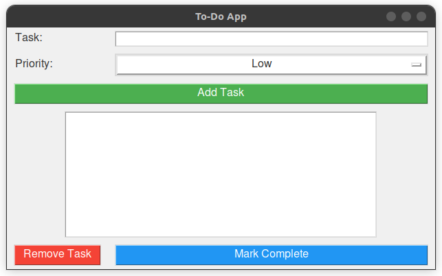

# To-Do App

This repository contains a simple To-Do app created using Python with a graphical user interface (GUI) built using Tkinter.

## Features

- Add tasks with priorities
- Remove tasks
- Mark tasks as completed
- Interactive GUI for easy task management

## Requirements

- Python 3.x
- Tkinter (usually included with Python installations)

## Usage

1. Clone the repository:

   ```bash
   git clone https://github.com/your-username/todo-app.git
   ```

2. Navigate to the project directory:

   ```bash
   cd PYTHON-ASSIGN
   ```

3. Run the app:

   ```bash
   python todo.py
   ```

4. Use the GUI to add, remove, and manage your tasks.

## Screenshots



## License

This project is licensed under the MIT License - see the [LICENSE](LICENSE) file for details.
